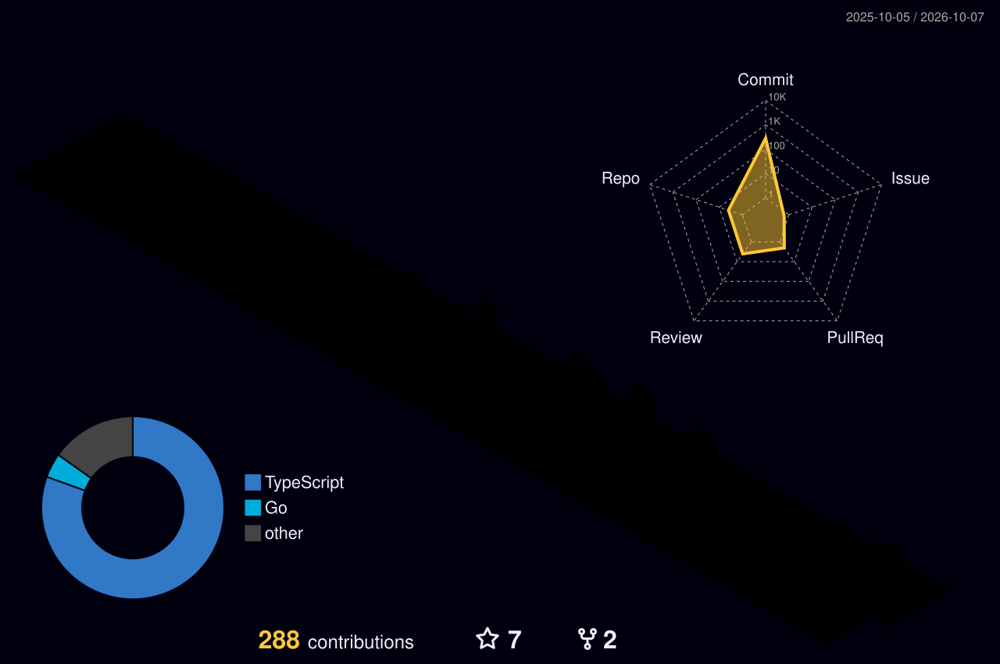

  

  Software engineer · M.S. student in Computer Science at <b>Sun Yat-sen University</b> · Previously at <b>AMD</b>

  <code>Go</code> · <code>TypeScript</code> · <code>Python</code> · <code>C++</code> · <code>Linux</code> · <code>Kubernetes</code> · <code>Docker</code>

---

<picture>
  <source
    media="(prefers-color-scheme: dark)"
    srcset="https://raw.githubusercontent.com/YuuinIH/YuuinIH/output/github-contribution-grid-snake-dark.svg"
  />
  <source
    media="(prefers-color-scheme: light)"
    srcset="https://raw.githubusercontent.com/YuuinIH/YuuinIH/output/github-contribution-grid-snake.svg"
  />
  
</picture>
